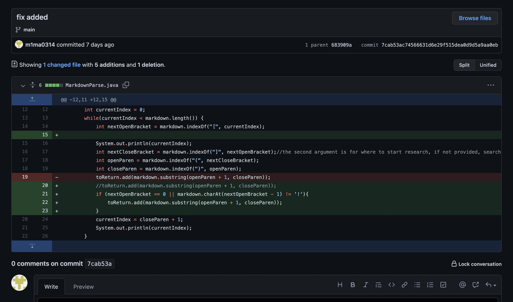
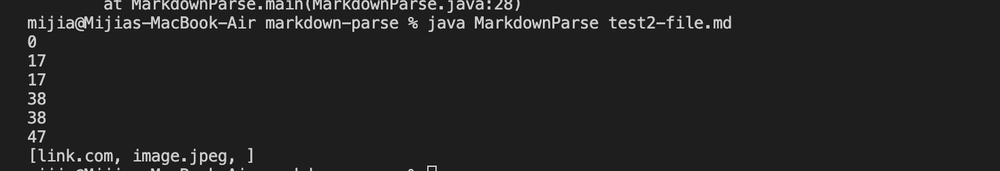
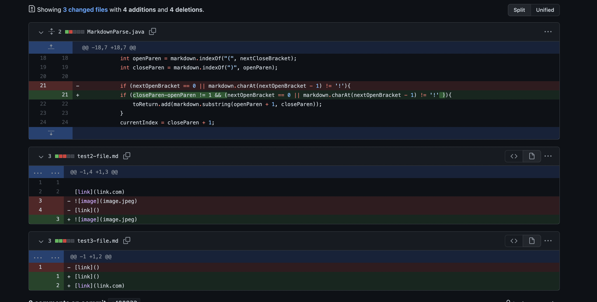
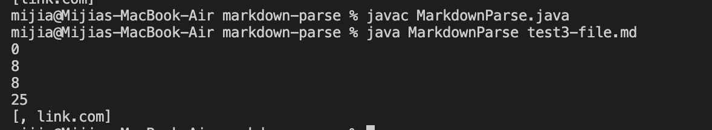
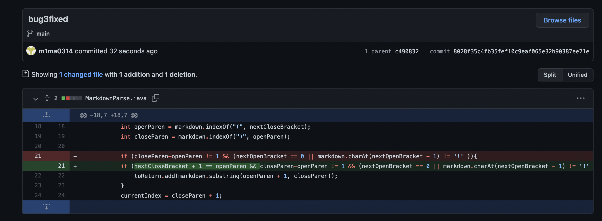
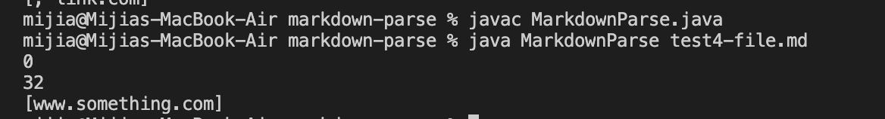

# Bug and Debug 👩‍💻👨‍💻

## 🔍 1st Code Change (Image or Link ???)

(add code for checking if input is link or image)

[failure-inducing input test file](https://github.com/m1ma0314/markdown-parse/blob/main/test2-file.md) \
👆(click me for more information)

❌ Symptom of that failure-inducing input

#### BUG
- We didn't have a way to check whether the input is for link or image

#### SYMPTOM
- We expect to get only the website link but also the image link.

#### FAILURE-INDUCING INPUT
- the format for link and the format for image are pretty similar in `md` file.

#### RELATIONSHIP 🧑‍🤝‍🧑
- Because the format of input in md file for both image and link is pretty similar and we don't have a way to check whether the input is only the link we want to print, we get a symptom of both printing website link and image link.

---

## 🔍 2nd Code Change (Real Link or Empty???)

(add code for checking if input link is not empty)

[failure-inducing input test file](https://github.com/m1ma0314/markdown-parse/blob/main/test3-file.md) \
👆(click me for more information)

❌ Symptom of that failure-inducing input

#### BUG
- We didn't have a way to check whether the input is an actual link instead of nothing.

#### SYMPTOM
- We expect to get only the website link but also the blank space.

#### FAILURE-INDUCING INPUT
- there is one fake link which is empty.

#### RELATIONSHIP 🧑‍🤝‍🧑
- Input in our test file has a empty link, but our code would not check whether our input is actually something or just empty. We get both empty link and the link we want in output.

---
## 🔍 3rd Code Change (Correct Link Format or Not???)

(add code for checking if input link is in `md` required link format)

[failure-inducing input test file](https://github.com/m1ma0314/markdown-parse/blob/main/test4-file.md) \
👆(click me for more information)

❌ Symptom of that failure-inducing input

#### BUG
- We didn't have a way to check whether the input is a correct format for link.

#### SYMPTOM
- We shouldn't get a output for link but we still get the link printed.

#### FAILURE-INDUCING INPUT
- An extra word `words` is inserted between `[link]` and `(link.com)`.

#### RELATIONSHIP 🧑‍🤝‍🧑
- Because we don't have a way to check if the input is in correct link format, we still get the link printed even when there is an extra word inserted between the correct format. We should only expect empty brackets.

---
### End of Lab Report 2
Hope I have everything needed 😇
