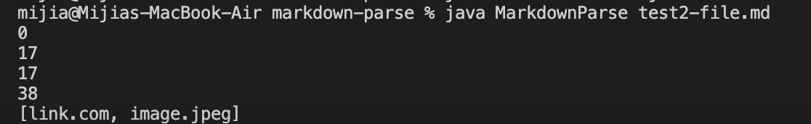

# Bug and Debug 👩‍💻👨‍💻
---
## 🔍 1st Code Change (Image or Link ???)

[failure-inducing input test file](https://github.com/m1ma0314/markdown-parse/blob/main/test2-file.md) 👈(click me for more information)

symptom of that failure-inducing input

#### BUG
- We didn't have a way to check whether the input is for link or image

#### SYMPTOM
- We expect to get only the website link but also the image link.

#### FAILURE-INDUCING INPUT
- the format for link and the format for image are pretty similar in `md` file.

#### Relationship
- Because the format of input in md file for both image and link is pretty similar and we don't have a way to check whether the input is only the link we want to print, we get a symptom of both printing website link and image link.

## 🔍 2nd Code Change (Actual Link???)