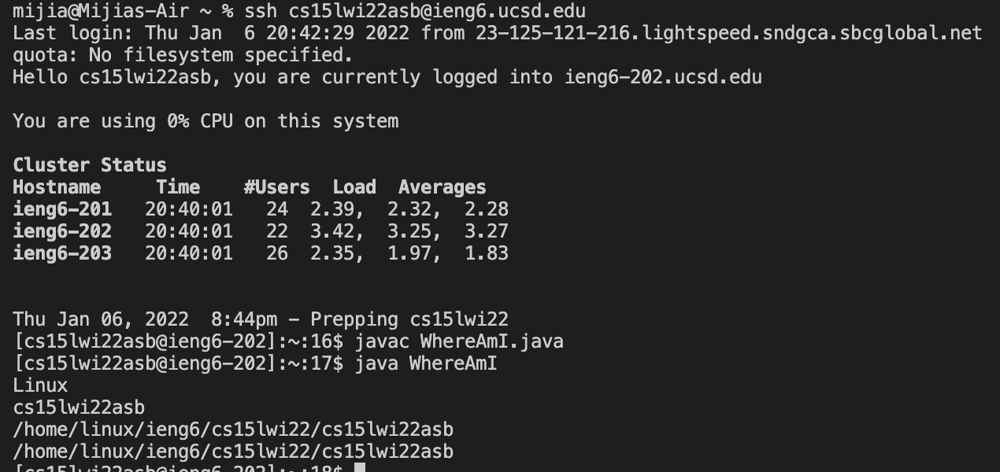

# Instructions for Remote Access

Hiiii! CSE15L Fellows Welcome! \
Today you will get to know how to log into a course-specific account on 'ieng6'. Ready?
I will try my best to help you:)

___

## 💡Part 1: Installing VScode
-you can skip this part if you have already installed:)
[Part 2](#Part-2:-Remotely-Connecting)

-Where you should go for installing\
[VScode](https://code.visualstudio.com/)(☺️Please click me)

After clicking the link, you can see such page. Click on the blue button for downloading:) It would not be difficult to follow the instructions to download and install.(Don't forget to choose the version you need😉)

This is what you will see after installing.

**Congradulations!** You now have the VS Code installed. This is a great tool to be used when you want to write code.

---

## Part 2: Remotely Connecting
In this part, you will get to learn how to connect to a remote computer over the Internet using VScode.

## 💡Part 3: Trying Some Commands
## 💡Part 4: Moving Files with scp
## 💡Part 5: Setting an SSH Key
## 💡Part 6: Optimizing Remote Running

[Lab Report 1](lab-report-1-week-2.html)\
[Lab Report 1](https://m1ma0314.github.io/cse15l-lab-reports/lab-report-1-week-2.html)
