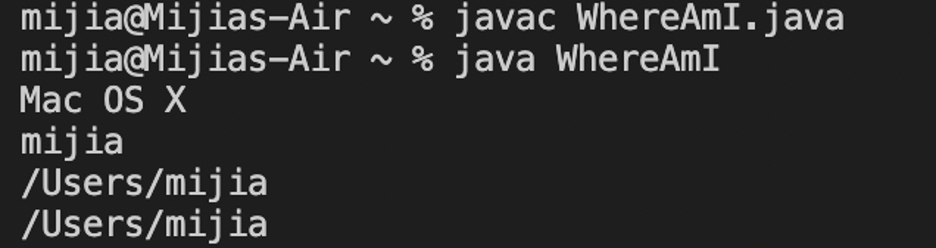
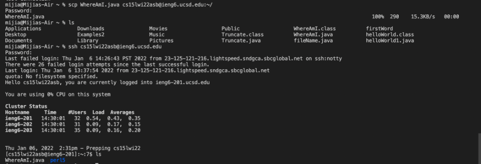
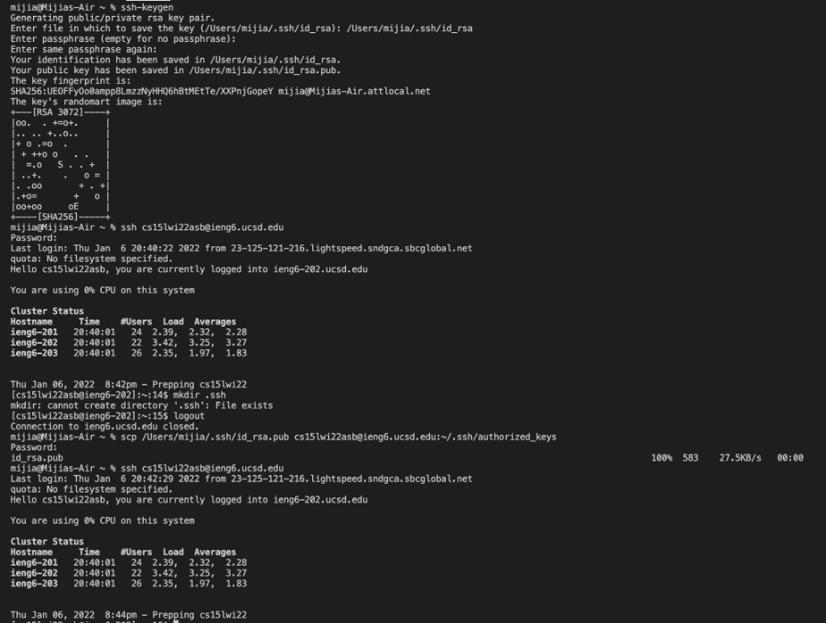

# Instructions for Remote Access 📖

Hiiii! CSE15L Fellows Welcome! \
Today you will get to know how to log into a course-specific account on 'ieng6'. Ready?
I will try my best to help you:)

___

## 💡 Part 1: Installing VScode
-you can skip this part if you have already installed:)\
(I skipped it because I already installed it in my CSE11 course)


-Where you should go for installing\
[Click me to VScode website👈](https://code.visualstudio.com/)


After clicking the link, you can see such page. Click on the blue button for downloading:) It would not be difficult to follow the instructions to download and install.(Don't forget to choose the version you need😉)


This is what I saw after installing(Yours should be pretty similar to mine).

**Congratulations!** You now have the VS Code installed. This is a great tool to be used when you want to write code.

---

## 💡 Part 2: Remotely Connecting
In this part, you will get to learn how to connect to a remote computer over the Internet using VScode.

If you are on Windows, there is one more thing to do.\
[Click me to Install OpenSSH👈](https://docs.microsoft.com/en-us/windows-server/administration/openssh/openssh_install_firstuse)

Every one has a specific 15L course account.\
I found it using the link below.\
[Click me for course-specific account👈](https://sdacs.ucsd.edu/~icc/index.php)

After finding your specific account, please open a terminal on VScode. I usually go to the top of the screen `Terminal` and choose `New Terminal`


Then put
`ssh cs15lwi22asb@ieng6.ucsd.edu`
into the terminal. You may have to replace my `asb` with your specific account.


Since I have already set the SSH key, it directly lets me log in.\
The only difference would be letting you enter `yes` first and enter your password. The remaining would be the same.

So, now we have successfully connected to the remote computer(yayyy🥳)

---

## 💡 Part 3: Trying Some Commands
Now it is time for you to run some commands on both your own computers and remote computers.


These are the commands that I have tried.
* `ls` - listing (lists files and directories within the file system)
* `ls -l` - long listing (shows a lot more information)
* `pwd` -print working directory (writes the full pathname of the current working directory to the standard output.)
* `cd` -change directory

After trying some commands, I try the command `exit` to log out of the remote server in my terminal. You could search for more commands and try!

---
## 💡 Part 4: Moving Files with scp
This part you will how amazing it is that you can copy files back and forth between the computers. (I got amazed anyway🤣)

Below are the steps I followed
* Step 1 Created a `WhereAmI.java` file on my computer
```
class WhereAmI {
  public static void main(String[] args) {
    System.out.println(System.getProperty("os.name"));
    System.out.println(System.getProperty("user.name"));
    System.out.println(System.getProperty("user.home"));
    System.out.println(System.getProperty("user.dir"));
  }
}
```
You could also use the contents.

* Step 2 Run `java` and `javac` on my computer

\
You probably saw something similar to my output.

* Step 3 Run the below commands\
`scp WhereAmI.java cs15lwi22asb@ieng6.ucsd.edu:~/`
-command using to copy file from my computer to remote computer\
`ssh` -log into ieng6\
`ls` - command to check whether the file is in home directory\
`java` and `javac` -run the code on `ieng6` computer


\
This is the output I got in my terminal.\
Try it now! You may get the similar out put as me.

---
## 💡 Part 5: Setting an SSH Key
Do you find it annoying putting your password everytime you want to login into the remote computer? Actually I did🤪.

Luckily, there is a way for us to solve this problem- `ssh` keys!


* Step 1: Put `ssh-keygen`\
I logged out first from last part because we need to run the code on our computer first.


-After these steps, you can see I have two new files, one private(`id_rsa`) and one public(`id_rsa.pub`). \
-Maybe it would be helpful for you to put something like `/Users/mijia/.ssh/id_rsa` as the file name the terminal asks. (I failed a lot of times when I created my own style file name🤪)

* Step 2: Put `mkdir .ssh` to copy the public key to the server\
-this part is also shown in the picture above. What I did is using `ssh` to login to the server first and put `mkdir .ssh`. Then I put scp again and my ssh key was set.

Congratulations!!!🥳 Now you are all set. 

---
## 💡 Part 6: Optimizing Remote Running
In this part, my group discussed several ways that can make the process of making a local edit to `WhereAmI.java` more pleasant.

-We can use the up arrow key to use previous commands.\
-We can type faster so the terminal would not ask us to put in our password another time.\
-We can use semicolons to run multiple commands on the same line in most terminals.

---
Above are all I have for you. Hope my experience helped you a lot 🥰. Good luck!!!


