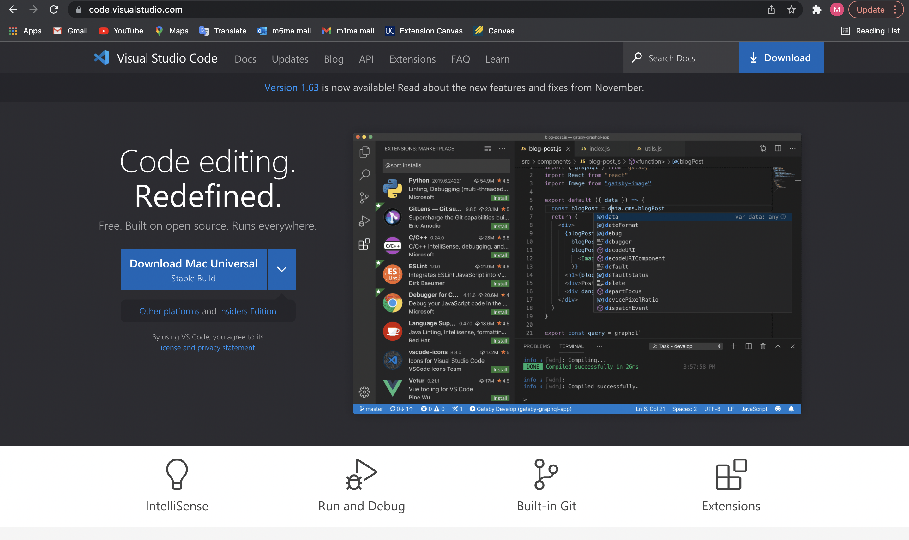
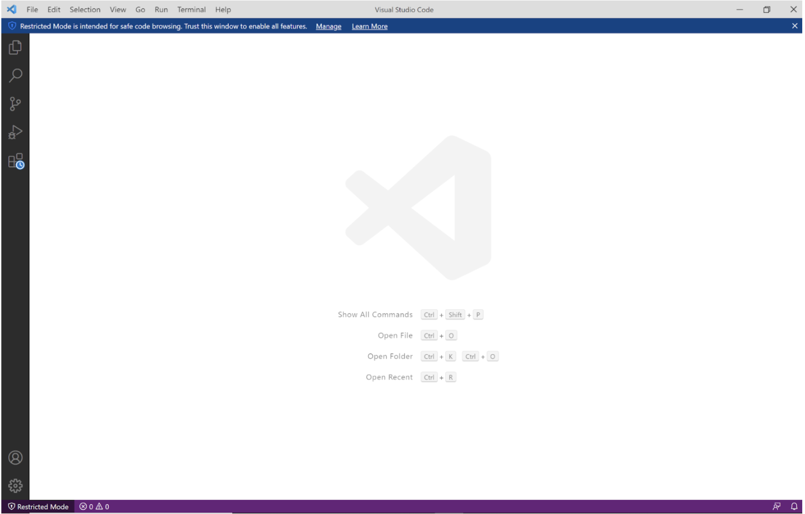
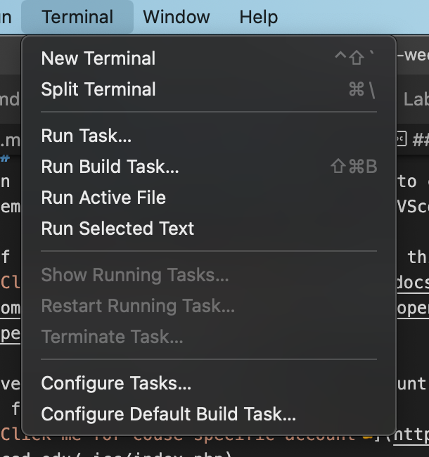
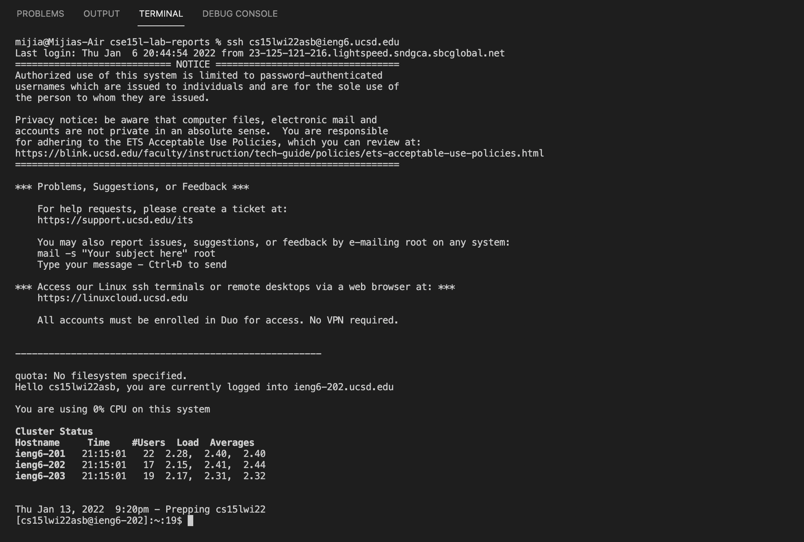
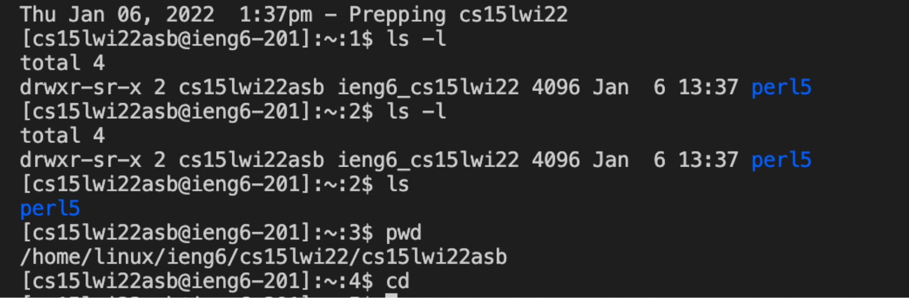

# Instructions for Remote Access

Hiiii! CSE15L Fellows Welcome! \
Today you will get to know how to log into a course-specific account on 'ieng6'. Ready?
I will try my best to help you:)

___

## Part 1: Installing VScode
-you can skip this part if you have already installed:)\
(I skipped it because I already installed it in my CSE11 course)

-Where you should go for installing\
[Click me to VScode website👈](https://code.visualstudio.com/)

After clicking the link, you can see such page. Click on the blue button for downloading:) It would not be difficult to follow the instructions to download and install.(Don't forget to choose the version you need😉)

This is what I saw after installing(Yours should be pretty similar to mine).

**Congratulations!** You now have the VS Code installed. This is a great tool to be used when you want to write code.

---

## Part 2: Remotely Connecting
In this part, you will get to learn how to connect to a remote computer over the Internet using VScode.

If you are on Windows, there is one more thing to do.\
[Click me to Install OpenSSH👈](https://docs.microsoft.com/en-us/windows-server/administration/openssh/openssh_install_firstuse)

Every one has a specific 15L course account.\
I found it using the link below.\
[Click me for course-specific account👈](https://sdacs.ucsd.edu/~icc/index.php)

After finding you specific account, please open a terminal on VScode. I usually go to the top of the screen `Terminal` and `New Terminal`

Then put
`ssh cs15lwi22asb@ieng6.ucsd.edu`
into the terminal. You may have to replace my `asb` with your specific account.

Since I have already set the SSH key, it directly lets me log in.\
The only difference would be letting you enter `yes` first and enter your password. The remaining would be the same.

So, now we have successfully connected to the remote computer(yayyy🥳)

---

## Part 3: Trying Some Commands
Now it is time for us to run some commands on both our own computers and remote computers.

These are the commands that I have tried.
* `ls` - listing (lists files and directories within the file system)
* `ls -l` - long listing (shows a lot more information)
* `pwd` -print working directory (writes the full pathname of the current working directory to the standard output.)
* `cd` -change directory

After trying some commands, I try the command `exit` to log out of the remote server in my terminal.

---
## Part 4: Moving Files with scp

## Part 5: Setting an SSH Key
## Part 6: Optimizing Remote Running

[Lab Report 1](lab-report-1-week-2.html)\
[Lab Report 1](https://m1ma0314.github.io/cse15l-lab-reports/lab-report-1-week-2.html)
