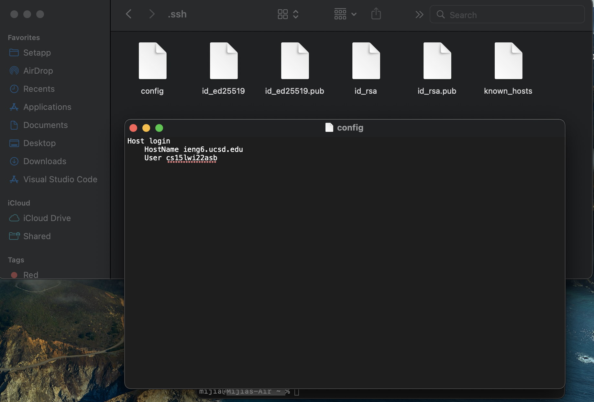

# Streamline `ssh` Configuration ⏳

## 🔍 Open and Edit `config` File

This screenshot shows where my config file is and what content my config file has.\
I am so lazy so I changed my alias to `login` 🤣

### How do I edit `config` file ✏️
- use `nano ~/.ssh/config` to continue editing my config file.
- copied past what lab writeup has and changed my alias to `login` after this page shows up.
- Use `control + O` and it asked me to confirm my file name and just click `enter`. 
- Use `control + X` to exit this page.

---
## 🖱️ Login into `ieng6`

As shown, I successfully login into my account using my alias `login` using the `ssh` command. And it doesn't need me to type in any complictaed username and passward.

---
## 🚄 Move Files over `ssh` with `scp`

As shown, I made a new java file in my computer directory.

As shown, I successfully moved the `lab3file.java` to `ieng6` directory. And I didn't need to type the original long username but only need my alias.

--- 
### End of Lab Report 3
Hope I have everything needed 😇

