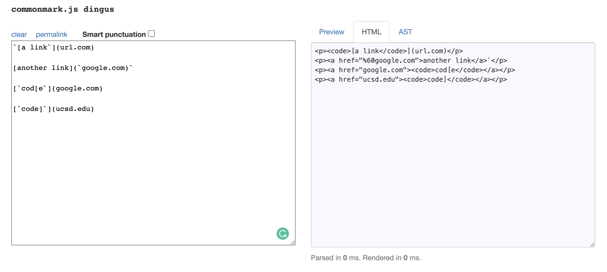
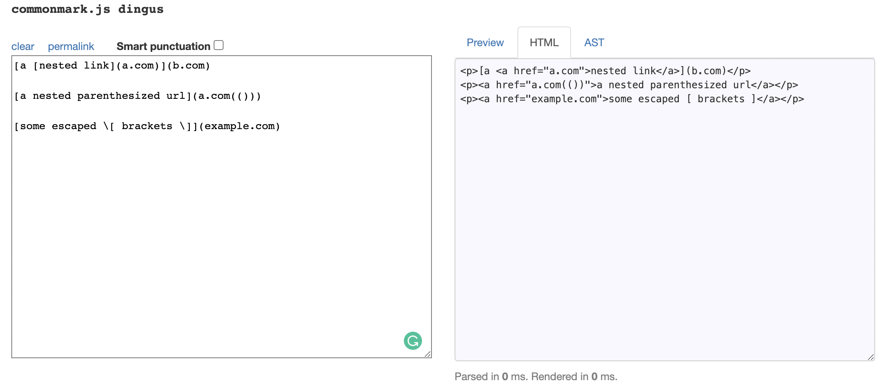
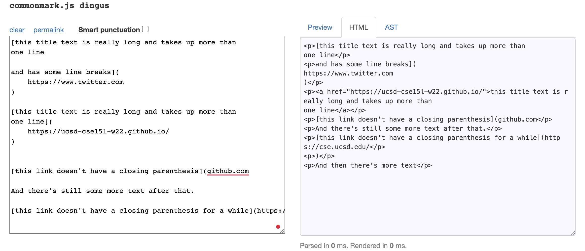
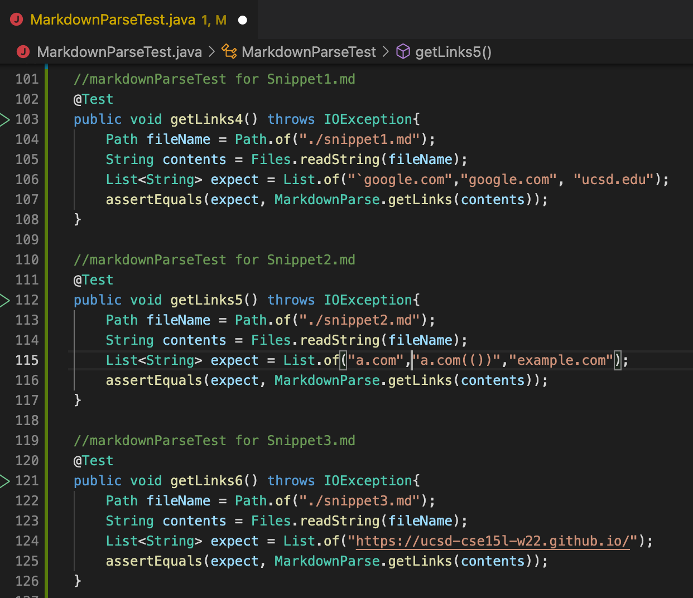
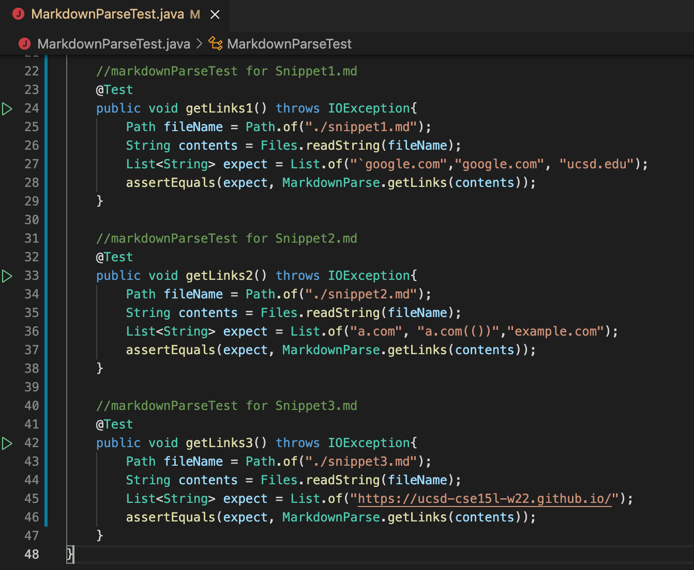
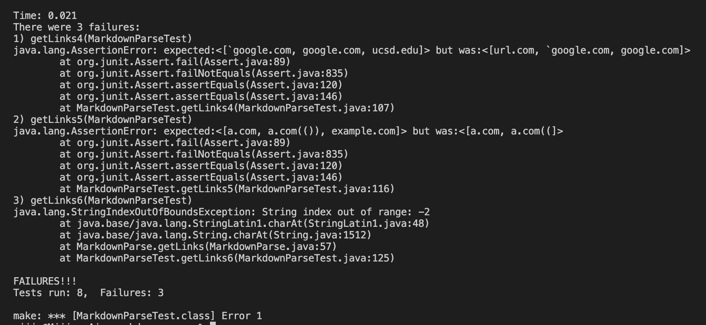
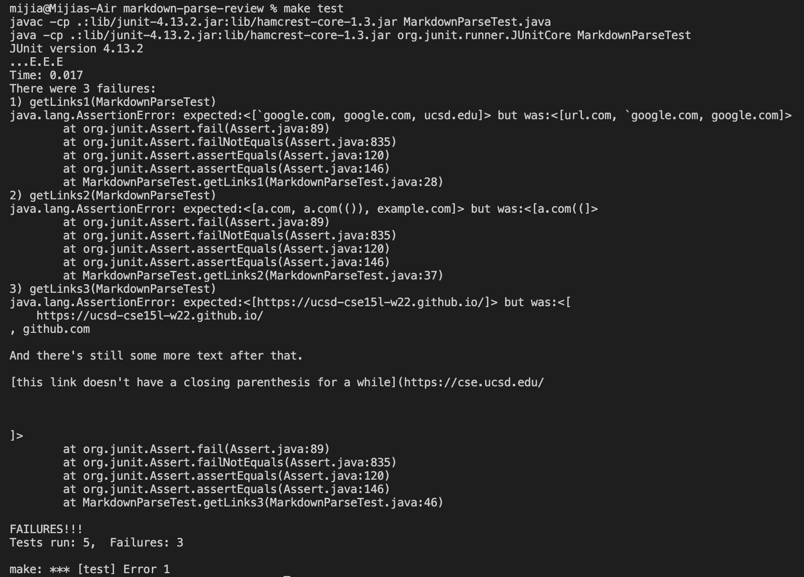

# Code Review 🧑‍💻👩‍💻
## 🔗 Part 1: Links to Repositories
- [My Own Repository](https://github.com/m1ma0314/markdown-parse)  
- [Repository Reviewed](https://github.com/sallada1/markdown-parse)

## 👀 Part 2: What Should be Produced?
Big Thanks to [the CommonMark demo site](https://spec.commonmark.org/dingus/) 😊

- Expected for `Snippet1`

- Expected for `Snippet2`

- Expected for `Snippet3`

---

## ⌨️ Part 3: Code Turning into a Test

- Tests added in my implementation of `markdown-parse`👇

- Tests added in the implementation my group reviewed 👇

---

## 🤦‍♀️ Part 4: Corresponding Test Output
Unfortunately, both my implementation of `markdown-parse` and the implementation my group reviewed.

- Corresponding output for my implementation 👇

- Corresponding output for the implementation reviewed 👇

---

## 🙋🏻‍♀️ Part 5: Brief Answers to Questions
- Q1: Do you think there is a small (<10 lines) code change that will make your program work for snippet 1 and all related cases that use inline code with backticks? \
`I think a small code change would make my program work. I should change the condition of checking "!" at the beginning to condition of checking any extra sign before the first "[", and have a loop to find the first "[" and the last "]" instead of just letting the index difference between "]" and "(" equal to 1.`

- Q2: Do you think there is a small (<10 lines) code change that will make your program work for snippet 2 and all related cases that nest parentheses, brackets, and escaped brackets? \
`I think there is a small code change for my program. I should have a part to find the final bracket and final parenthesis instead of simply finding the first one. And I should change the condition when I want to add something for toReturn.`

- Q3: Do you think there is a small (<10 lines) code change that will make your program work for snippet 3 and all related cases that have newlines in brackets and parentheses? \
`For this one, I also think the code change would be larger than 10 lines. Because my current error output is out of bounds. There should be something wrong with my index checking part. And I have to make sure that my code would work to trim all the blank spaces and delete the unuseful part we want. `

