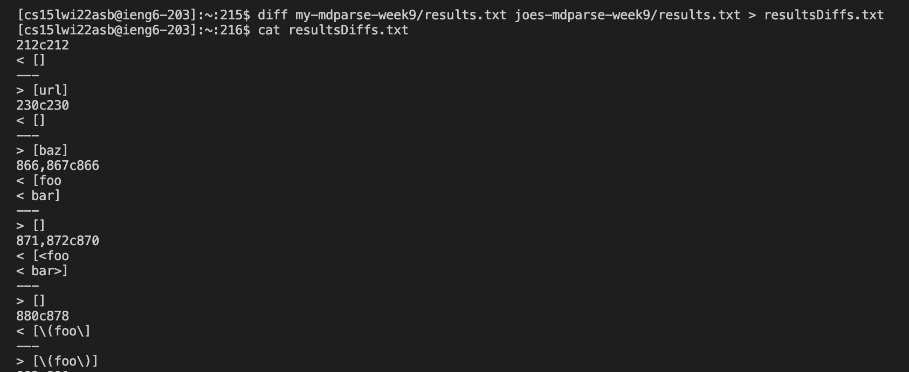
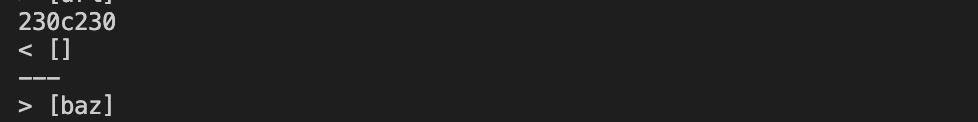
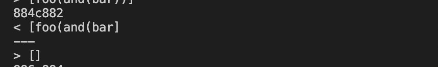
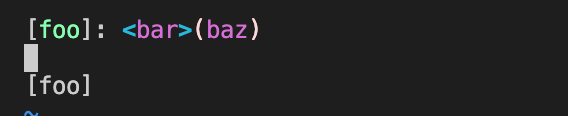
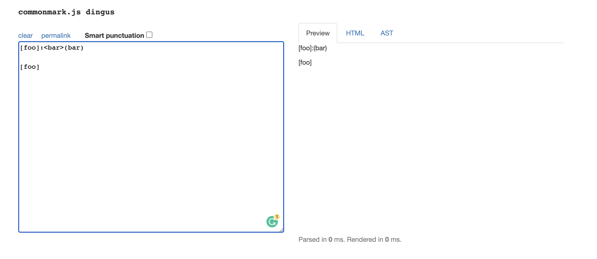
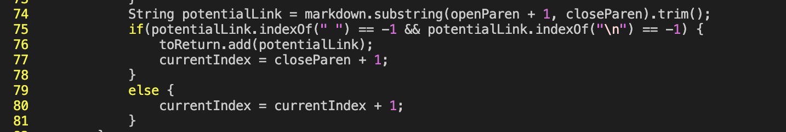
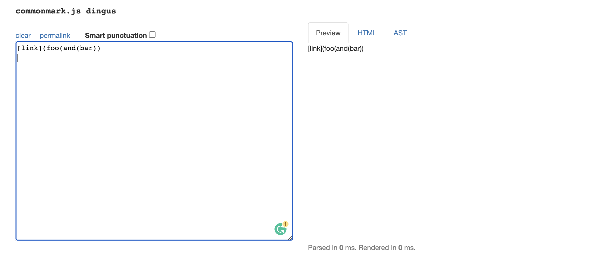

# Comparing Two Implementations 🔬
## 🔍 Part 1: Find Tests with Different Results 

Figure1: Screenshot of terminal showing `diff` used to show the differences of two files in a stylized format

In general, I found the differences in tests using `diff` to help me list out all the differences between two test files. I add `> resultsDiffs.txt` after the `diff` command to put all the output in a separate file. Then I print out the file which saved the differences.

- The first difference I chose

As shown in the picture, there is a difference between line 230 of two files.

- The second difference I chose

As shown in the picture, there is another difference between line884 of my test file and line 882 of joe's.

Then I use `vim` to figure out the corresponding test files which have these differences. I enter `:set number` to better find the specific lines. 

- The first test file with difference is test file `201.md`

-Figure: Output for `my-mdparse-week9\results.txt`

-Figure: Output for `joes-mdparse-week9/results.txt`

- The second test file with difference is test file `496.md`

-Figure: Output for `my-mdparse-week9\results.txt`

-Figure: Output for `joes-mdparse-week9/results.txt`
---
## 🛠️ Part 2: Find and Address the Problem
### Difference #1: `test-files/201.md\`
- Test file contents:

-My output: `[]`\
-Joe's output: `[baz]`\
-Expected output(Screenshot of [CommonMark demo site](https://spec.commonmark.org/dingus/)):

-Correct implementation: My Repo

- `_bug` for the first difference in Joe's code\
As the screenshot of the expected output shown, the content in test file `201.md` is not a valid link. Because there is something between the close bracket and the open parenthesis.

The reason I think is that there is no check for space or characters between `]` and `(` at lines 75-76. We could add a condition to check if the first `(` index and the last `]` only has a difference of 1.

### Difference #2: `test-files/496.md\`
- Test file contents:

-My output: `[foo(and(bar]`\
-Joe's output: `[]`\
-Expected output:

-Correct implementation: Joe's Repo

- `_bug~` for the second difference in my code\
As the screeenshot of the expected output shown, the content in test file `496.md` is also not a valid link input. Because there are too many open parenthesis inserted in the content. There is one missing its own closed parenthesis.

In my code, there is nowhere to check if the parenthesis are paired. When finding the the `closeParenthesis`, I should have another method to find the real last one.

---
## 🥳 End of Lab Report 5
Hope I get everything expected 😇.

💖 To all CSE15L Faculty:\
Thank you so much for all the efforts and time teaching us!!! Hope everyone has a GREAT day EVERY day!!!